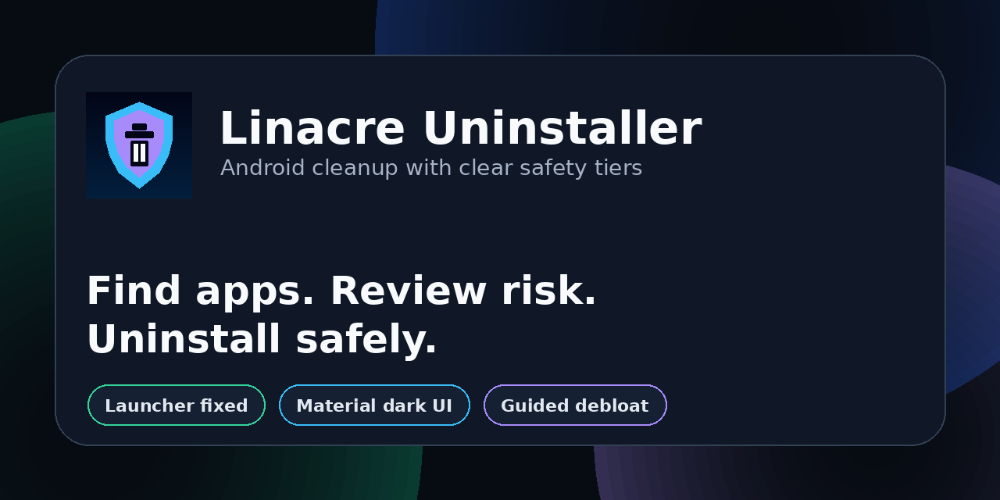
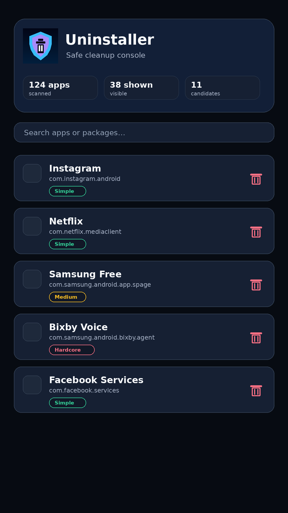
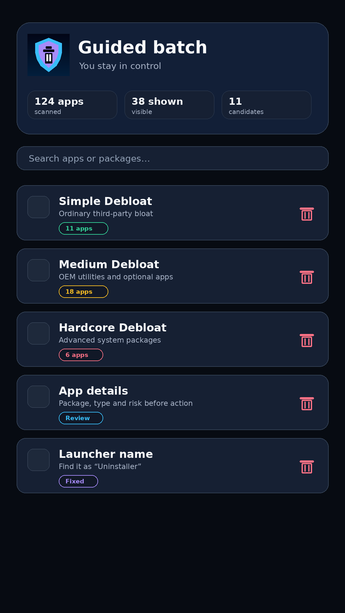

<div align="center">
  

  # Linacre Uninstaller

  **A safer Android uninstaller and debloat review tool with a clean launcher icon, guided risk tiers and a polished Material dark UI.**<br>
  Part of the [linacre.site](https://www.linacre.site/) open-source ecosystem.

  [](https://github.com/LIN4CRE/LinacreUninstaller/releases/latest)
  [](https://kotlinlang.org/)
  [](https://developer.android.com/)
  [](LICENSE)
</div>

---

## What is fixed in v1.3.1

- **Launcher discoverability fixed:** the installed app now appears as **“Uninstaller”** in the launcher/app drawer instead of being hard to find only through Settings → Apps.
- **New app icon:** refreshed shield/trash icon across adaptive and legacy launcher assets.
- **Cleaner onboarding:** first launch explains safety tiers and tells users exactly what launcher name to look for.
- **Polished main UI:** new hero console, search card, stats row, better spacing and cleaner dark Material styling.
- **Safer batch flow:** batch uninstall now works from the current tab/filter scope and warns before processing system apps.
- **Better app rows:** rounded cards, clearer badges, package names, app sizes and tap-for-details dialog.
- **Privacy/security hardening:** app backup disabled and cleartext traffic disabled.
- **Better repo presentation:** new banner and higher quality screenshots.

## Screenshots

<div align="center">
  
  &nbsp;&nbsp;
  
</div>

## Features

- **Search installed apps** by app name or package name.
- **Separate User/System tabs** so risky system packages are not mixed into ordinary app cleanup.
- **Risk tiers** for simple, medium and hardcore debloat candidates.
- **Guided uninstall prompts** using Android's official uninstall flow — no silent deletion surprises.
- **Batch queue helper** for selected risk tiers.
- **App details dialog** before taking action.
- **Pull-to-refresh** after installs/uninstalls.

## Installation

1. Open the [latest release](https://github.com/LIN4CRE/LinacreUninstaller/releases/latest).
2. Download the APK.
3. Install it on your Android phone. You may need to allow “install unknown apps” for your browser or file manager.
4. After installing, look for **Uninstaller** in your app drawer/launcher.

> If Android says the app cannot be installed because a package already exists, uninstall the old debug build first from Settings → Apps → Linacre Uninstaller, then install this release. Older debug releases were built with a different debug signing key.

> If you still cannot see it, search your launcher for **Uninstaller**. The package name is `site.linacre.uninstaller`.

## Safety model

Linacre Uninstaller does **not** silently remove apps. It opens Android's normal uninstall confirmation screen so you stay in control.

- **Simple** — ordinary third-party bloat and social/media apps.
- **Medium** — OEM utilities and optional services. Review first.
- **Hardcore** — telemetry or deep system packages. Advanced users only.

If a system app removal causes problems, you may be able to restore it with ADB:

```bash
adb shell cmd package install-existing <package.name>
```

## Build from source

```bash
git clone https://github.com/LIN4CRE/LinacreUninstaller.git
cd LinacreUninstaller
./gradlew assembleDebug
```

Debug APK output:

```text
app/build/outputs/apk/debug/app-debug.apk
```

## Technical notes

- Kotlin + Android XML views.
- Android 7.0+ / API 24+.
- Uses `QUERY_ALL_PACKAGES` to show installed apps.
- Uses `REQUEST_DELETE_PACKAGES` and Android's official uninstall intent.
- No analytics, no network calls, no account system.

## Roadmap

- Optional Shizuku/ADB assisted mode.
- Export/import debloat lists.
- Manufacturer-specific safe lists.
- Undo guidance per package.
- Signed release pipeline once account CI is available.

## License

MIT — see [LICENSE](LICENSE).

---

<div align="center">
  Built by <a href="https://github.com/LIN4CRE">David Linacre</a> · <a href="https://www.linacre.site/">linacre.site</a>
</div>
